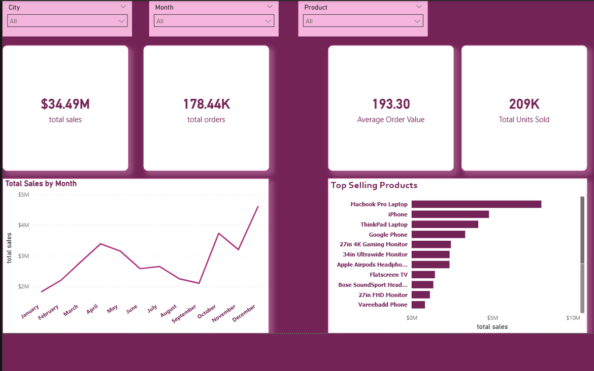
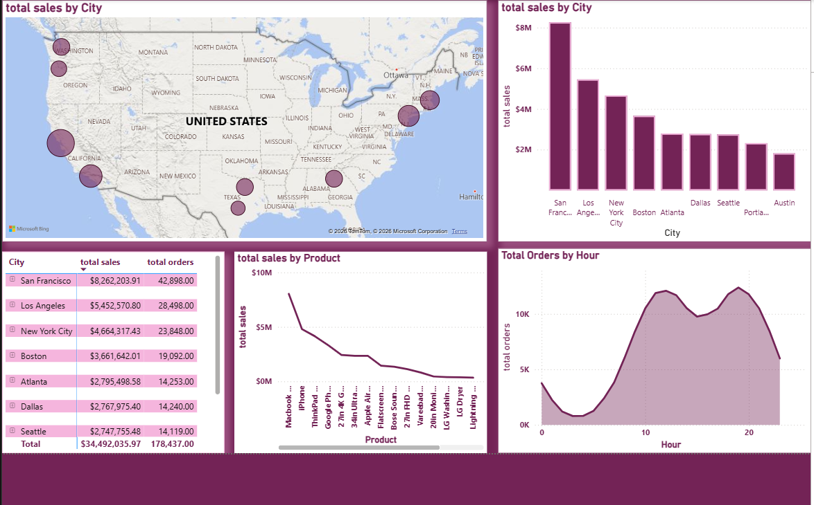
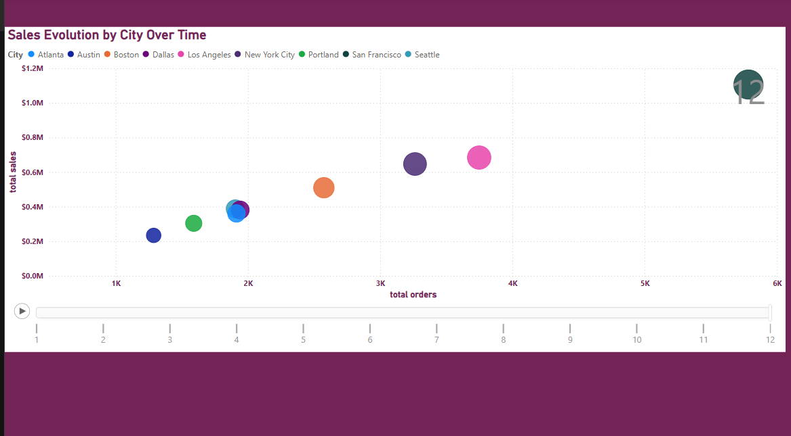

# Sales Performance Dashboard 📊
A dynamic Power BI dashboard created to analyze sales trends and KPIs.

## Key Features:
- Trend analysis over time.
- Interactive filters for regions and products.
- Growth metrics and KPI cards.

## Preview:

